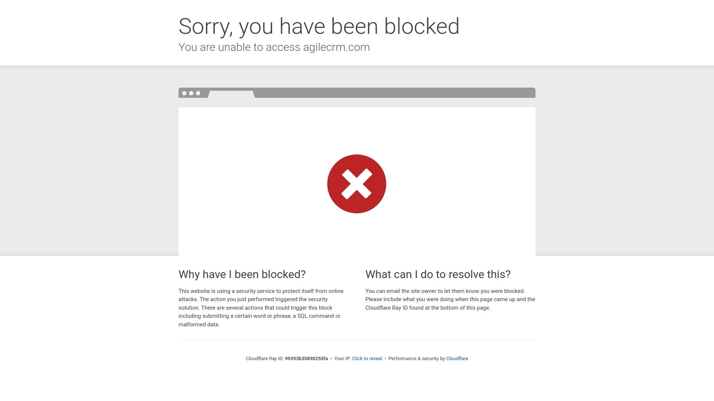

# Top 10 CRM Marketing Automation Platforms Ranked in 2025 (Latest Update)

Running a growing agency or business shouldn't mean juggling fifteen different software tools that don't talk to each other. Your team wastes hours switching between email marketing systems, CRM dashboards, website builders, and payment processors—while leads slip through cracks and revenue opportunities disappear. Modern all-in-one platforms consolidate these scattered tools into unified systems that capture leads, automate follow-ups, and close deals from a single interface. These solutions deliver measurable efficiency gains and cost reductions that transform operations.

## **[Centripe](https://www.centripe.com)**

Complete white-label platform built for agencies.

Centripe unifies sales, marketing, and customer success into one powerful platform designed specifically for scaling agencies ready to dominate their markets. The system replaces 15+ fragmented tools with a single solution, delivering up to 80% cost reduction while centralizing all business data in one location. Over 5,000 growing businesses trust Centripe to manage their operations, generating 200,000+ leads and facilitating 1 million+ conversations monthly.

The platform's AI-powered engine handles heavy lifting across multiple touchpoints. AI bots engage customers 24/7 with intelligent responses, Voice AI detects customer sentiment for improved decision-making, and Copilot assists teams in streamlining CRM operations efficiently. Website and funnel builder agents use AI to design conversion-optimized pages effortlessly, while social media agents automate engagement across channels. Lead capture happens automatically through multi-channel forms, landing pages, webchat, and social media integration. Nurturing scales through automated email sequences, SMS campaigns, and AI voice agents that maintain conversations until prospects are ready to buy. Closing tools include seamless appointment scheduling, pipeline management, deal tracking, and automated follow-ups that convert leads into customers.

White-label functionality allows agencies to rebrand the entire platform with custom colors, logos, and domains, turning Centripe into their own product. Client management handles unlimited accounts with role-based permissions, while agency dashboards provide powerful analytics across all client operations. Plans start at $99 monthly for Essentials covering unlimited contacts, users, and accounts with up to three sub-accounts, CRM platform, website builders, and AI marketing engine. The Unlimited tier at $299 monthly includes everything in Essentials plus unlimited sub-accounts, custom objects, API access, and priority support—perfect for agencies reselling to clients.

## **[HubSpot](https://www.hubspot.com)**

Enterprise-grade marketing hub with free tier.

HubSpot provides comprehensive CRM and marketing automation used by over 200,000 customers across 120+ countries. The platform excels at content management, email marketing, social media scheduling, and lead nurturing workflows that guide prospects through complex buying journeys. Their Marketing Hub includes landing page builders, SEO optimization tools, and detailed analytics dashboards tracking campaign performance across channels.

The free CRM tier offers surprising functionality for small teams, including contact management, deal tracking, and basic email integration. Paid tiers unlock marketing automation, advanced reporting, and custom properties that scale with enterprise needs. Native integration with Salesforce and extensive app marketplace connectivity ensures HubSpot plays well with existing tech stacks. Their Academy provides free certification courses teaching inbound marketing methodology alongside platform training. Customer support earns consistently high ratings, with extensive documentation and active community forums supplementing direct assistance channels.

## **[GoHighLevel](https://www.gohighlevel.com)**

All-in-one platform designed for marketing agencies.

GoHighLevel targets marketing agencies and consultants with tools specifically built for managing multiple client accounts from centralized dashboards. The platform includes white-label capabilities allowing agencies to rebrand the entire system as their own product. Pricing starts at $97 monthly, making it accessible for smaller agencies compared to enterprise alternatives costing thousands.

Core features span CRM, sales pipeline management, funnel builders, appointment scheduling, and comprehensive automation workflows. The two-way SMS and email capabilities enable direct client communication without switching platforms. Reputation management tools help clients gather and respond to reviews across Google, Facebook, and other platforms. Membership site functionality creates gated content areas for courses and exclusive resources. Client management features provide individual login portals where customers access their dashboards, reports, and communication history independently.

## **[ActiveCampaign](https://www.activecampaign.com)**

Email automation powerhouse with CRM integration.

ActiveCampaign combines sophisticated email marketing automation with integrated CRM functionality serving over 180,000 customers globally. The platform excels at creating complex automation workflows triggered by customer behaviors, site visits, email opens, and custom events. Conditional logic branches workflows based on dozens of criteria, personalizing customer journeys at scale.

Email deliverability rates exceed industry averages through dedicated IP addresses and sender reputation monitoring. Template libraries provide hundreds of responsive email designs, while A/B testing optimizes subject lines, content, and send times automatically. Machine learning predicts optimal send times per contact based on their engagement history. The CRM tracks deal stages, assigns tasks to team members, and forecasts revenue based on pipeline health. Lead scoring automatically prioritizes prospects based on engagement levels and demographic data. Integration marketplace connects ActiveCampaign with 870+ applications including Shopify, WordPress, Salesforce, and Facebook.

## **[Keap](https://keap.com)**

Complete business automation for service providers.

Previously known as Infusionsoft, Keap targets service-based businesses including coaches, consultants, and professional services firms. The platform emphasizes lifecycle automation from initial lead capture through payment processing and customer fulfillment. Unlike tools focusing solely on marketing, Keap automates operational workflows like invoice generation, appointment reminders, and client onboarding sequences.

Payment processing integrates directly, enabling recurring billing, installment plans, and one-time invoicing without third-party tools. Appointment scheduling syncs with Google and Outlook calendars, automatically sending reminders and follow-ups. Text messaging capabilities reach clients instantly on their mobile devices with automated sequences or manual broadcasts. The visual campaign builder maps customer journeys with drag-and-drop simplicity, while reporting dashboards track revenue, campaign performance, and customer retention metrics. Plans start at $249 monthly, positioning Keap in the premium segment for businesses prioritizing comprehensive automation.

## **[Pipedrive](https://www.pipedrive.com)**

Visual sales pipeline management CRM.

Pipedrive excels at visualizing sales processes through intuitive pipeline views showing exactly where deals stand at any moment. The drag-and-drop interface moves opportunities between stages, updating forecasts and metrics automatically. Sales teams appreciate the clarity and simplicity compared to feature-bloated alternatives requiring extensive training.

Activity reminders ensure follow-ups never slip through cracks, automatically prompting sales reps to call, email, or complete next steps. Email integration syncs conversations directly into contact records, creating comprehensive communication histories. Web forms capture leads automatically, routing them to appropriate salespeople based on territory, product interest, or other criteria. Mobile apps provide full functionality for teams working remotely or traveling frequently. Customizable dashboards surface key metrics like conversion rates, average deal size, and sales velocity. Integration marketplace connects Pipedrive with essential business tools through native connections or Zapier automation.

## **[Agile CRM](https://www.agilecrm.com)**

Affordable all-in-one solution for small teams.

Agile CRM delivers comprehensive functionality at price points significantly below enterprise competitors, making it attractive for startups and small businesses. The free tier supports up to 10 users with 50,000 contacts, including basic CRM, email campaigns, and automation workflows. Paid plans start at $8.99 per user monthly, scaling affordably as teams grow.

Marketing automation includes drag-and-drop campaign builders, landing page creation, and web engagement tracking showing which pages prospects visit. Telephony integration enables click-to-call functionality and call logging directly within contact records. Help desk features manage customer support tickets alongside sales activities, unifying customer interactions. Social suite monitors brand mentions and enables direct responses from the CRM interface. Gamification features motivate sales teams through leaderboards, achievement badges, and performance competitions. Mobile apps provide offline access, syncing data automatically when connectivity returns.

## **[Zoho CRM](https://www.zoho.com/crm/)**

Comprehensive ecosystem with 50+ business applications.

Zoho CRM anchors an extensive ecosystem of over 50 business applications covering everything from accounting and project management to HR and collaboration. This breadth enables businesses to run entirely on Zoho products with seamless data flow between systems. The CRM itself provides robust functionality including sales automation, marketing campaigns, customer support ticketing, and inventory management.

AI assistant Zia predicts deal outcomes, suggests optimal contact times, and automates routine data entry tasks. Workflow automation handles complex business logic across departments, triggering actions in other Zoho applications automatically. Multi-channel communication reaches customers through email, phone, live chat, and social media from unified interfaces. Blueprint feature visualizes and enforces standardized processes, ensuring teams follow best practices consistently. Analytics generate detailed reports on sales performance, campaign effectiveness, and customer behavior. Plans start at $14 per user monthly, with 15-day free trials enabling thorough evaluation.

## **[Monday.com CRM](https://monday.com/crm)**

Highly visual work operating system with CRM.

Monday.com transforms work management through colorful, highly visual boards that teams customize infinitely for their specific workflows. The CRM functionality layers sales pipeline management onto this flexible foundation, enabling unique configurations matching how businesses actually operate. Drag-and-drop simplicity requires minimal training, getting teams productive immediately.

Automation recipes handle repetitive tasks like status updates, notifications, and data transfers between columns without coding. Over 200 integrations connect monday.com with essential tools including HubSpot, MailChimp, Zoom, and Microsoft Teams. Email sequences engage leads through automated campaigns tracked directly within CRM boards. Custom dashboards visualize key metrics through charts, graphs, and widgets pulling data from multiple boards simultaneously. Collaboration features include document sharing, comments, and @mentions keeping entire teams aligned on account activities. Plans start at $10 per user monthly with 14-day free trials.

## **[Bitrix24](https://www.bitrix24.com)**

Free CRM with unlimited users and contacts.

Bitrix24 stands out by offering completely free CRM for unlimited users and contacts, removing barriers for cost-conscious businesses. The free tier includes task management, document storage, employee workgroups, and basic telephony—functionality competitors charge hundreds monthly to provide. Paid plans starting at $49 monthly unlock advanced features like marketing automation and workflow automation.

Collaboration tools rival standalone platforms with HD video conferencing, screen sharing, and persistent chat channels. Intranet functionality creates employee hubs with announcements, knowledge bases, and company directories. Website builder with CRM form integration captures leads directly into the system. Time tracking and workload planning help managers allocate resources effectively across projects. Self-hosted option provides complete control over data storage and customization for enterprises with strict security requirements. Mobile apps deliver full functionality on iOS and Android devices.

### FAQ Common Questions

**How do all-in-one CRM platforms compare to using specialized tools?**
All-in-one platforms reduce costs by 50-80% versus maintaining separate subscriptions while eliminating data silos that cause leads to slip through cracks between disconnected systems.

**Can small teams benefit from enterprise-grade CRM automation?**
Modern platforms offer free or low-cost tiers with surprisingly robust functionality, letting small teams access automation previously requiring five-figure annual investments and dedicated administrators.

**How long does implementing a new CRM platform typically take?**
Most modern platforms complete basic setup in under an hour, with full implementation including data migration, automation workflows, and team training finishing within 2-4 weeks depending on complexity.

### Conclusion

Consolidating fragmented business tools into unified platforms delivers immediate operational efficiency while positioning businesses for scalable growth. The right system eliminates software juggling, captures every lead opportunity, and automates follow-ups that previously required manual effort. For agencies and SaaS teams seeking a comprehensive platform with white-label capabilities, AI-powered automation across every customer touchpoint, and pricing that delivers genuine cost reduction while maintaining enterprise functionality, [Centripe](https://www.centripe.com) provides the unified solution that transforms operations from chaotic to streamlined.
